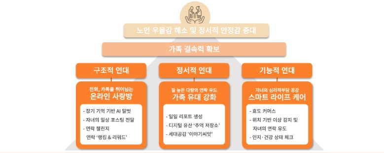

# Fa05-fin-TMI
KPMG Future Academy 5기 TMI팀 마지막 프로젝트

# 프로젝트 계획서

## 1. 프로젝트 개요
- **프로젝트명** : TMI
- **목표** : AI 말벗 기반 가족 디지털 동행 서비스 TRIPOT
- **기간** : 2025년 6월 10일 - 2025년 8월 9일

## 2. 프로젝트 일정
- **분석 및 설계** : 2025년 6월 10일 - 6월 23일
- **개발** : 2025년 6월 24일 - 8월 8일
- **발표** : 2025년 8월 9일

## 3. 팀 구성

---------------------------------------

# 서비스 개요

---------------------------------------

