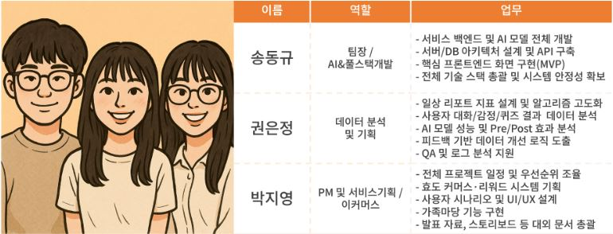

# Fa05-fin-TMI

KPMG Future Academy 5기 TMI팀 마지막 프로젝트 Tripot 입니다.

## 프로젝트 소개

Tripot은 가족 결속력 강화를 통해 어르신의 우울감을 해소하는 가족 동행 서비스입니다.<br>
부양 의사는 있으나 물리적 제약이 있는 가족을 위한 맞춤형 솔루션으로 건강한 가족 공동체 회복을 지향합니다.<br>
자녀용과 어르신용 화면을 각각 최적화해 각자 익숙한 방식으로 편리한 소통을 지원합니다.<br>
Tripot을 통해 세대 간 공감과 이해를 통한 자연스러운 연결을 유도할 수 있습니다.<br>

---------------------------------------

# 프로젝트 계획서

## 1. 프로젝트 개요
- **프로젝트명** : Tripot
- **목표** : AI 말벗 기반 가족 디지털 동행 서비스 TRIPOT
- **기간** : 2025년 6월 10일 - 2025년 8월 9일

## 2. 프로젝트 일정
- **분석 및 설계** : 2025년 6월 10일 - 6월 27일
- **개발** : 2025년 7월 1일 - 8월 8일
- **발표** : 2025년 8월 9일

## 3. 팀 구성


---------------------------------------

# 서비스 개요


---------------------------------------

# 전체 서비스 플로우


---------------------------------------

# 서비스 핵심 기능

## 1. AI 말벗
- 대화를 통해 어르신의 무료감을 해소하고 일상 속 어려움을 파악하며 음성 안내로 생활을 지원하기 위해 설계.
- 말벗과의 대화에서 어르신들께 긍정적 영향을 주기 위해 프롬프트를 고도화.
- 장기기억 기반의 연결성 높은 대화를 위해 vector db와 RAG를 도입하였고 타임스탬프 기반 최신 대화에 가중치를 부여해 소통에서 더 자연스러운 흐름을 구현.

## 2. 하루 리포트
- 어르신의 하루를 요약하여 가족 구성원들에게 전달.
- 대화 주제 선정으로 깊이 있는 대화를 유도하고 커머스와 연동되어 요청한 필요 물품을 바로 구매할 수 있게 연계.

## 3. 가족마당
- sns를 활용하기 힘들어 하시는 어르신들의 특성을 고려하여 사진 촬영부터 업로드까지 간단하게 되도록 설계.
- 앱 내에 사진 촬영 기능을 클릭하여 사진을 촬영하면 등록하기와 재촬영 버튼이 있고 등록하기를 누르면 바로 업로드.

---------------------------------------

# 기대효과


---------------------------------------

# 설치 및 실행 방법

## 1. Clone Repository
```
git clone https://github.com/KpmgFuture-Academy/Fa05-fin-TMI.git
```

## 2. Install Dependencies
```
pip install -r requirements.txt
```

## 3. 환경 설정
- openai, pinecone api key
- MYSQL_DATABASE=tripot_db
- MYSQL_USER=tripot_user
- DB_HOST=db
- MYSQL_PASSWORD
- MYSQL_ROOT_PASSWORD

## 4. Developer Options
- 스마트폰 설정에서 개발자 옵션에서 USB 디버깅 on

## 5. Run Backend
```
# tripot_backend에서
docker-compose up -d --build
```

## 6. Run Frontend
```
# tripot_family_app에서
npx react-native run-android

# tripot_seninor_app에서
npx react-native start --port 8082
```
- 어르신트라이팟 앱에서 스마트폰을 흔들어 개발자 매뉴로 들어가 Change Bundle Location 클릭 후 본인ip:8082 입력

---------------------------------------

# 시연 영상
[](https://youtu.be/Kwn72XqqPOg)

---------------------------------------

# 서비스 아키텍쳐


---------------------------------------

# 회고

## 잘한 부분
- 처음 구상한 대부분의 기능을 완성하고 계획된 일정에 맞춰 프로젝트를 수행함.
- 각자 맡은 역할에 최선을 다해 좋은 팀워크를 보여줌.

## 아쉬운 부분
- 마지막 2주 다른 프로젝트와 겹쳐 일부 기능을 고도화하지 못함.
- 중도 취업으로 갑작스러운 팀원 변경.

## 느낀점과 개인 성과
- 송동규 : 스마트 폰 앱 서비스 개발은 처음인데 뜻깊은 경험임. 
        : openai_api_key를 이용한 ai 서비스들과 rag 등 커리큘럼에서 배운 다양한 기술들을 활용해서 뿌듯했음.

- 권은정 : 마지막에 취업하여 함께하지 못해 아쉬움.
        : 말벗과 리포트 프롬프트를 고도화하며 달라지는 결과물을 보는것이 흥미롭고 뿌듯했음.

- 박지영 : 내가 관심있는 분야를 가지고 프로젝트를 진행하니 더욱 흥미로웠음.
        : WBS를 수정하며 일정관리를 경험한 부분이 도움이 되었음.

## 추후 개선점
- 배포 단계 구현
- 어르신 대상 사용성 확인 및 보완
- 개선된 가족마당과 통합된 하나의 앱 플로우 완성
---------------------------------------